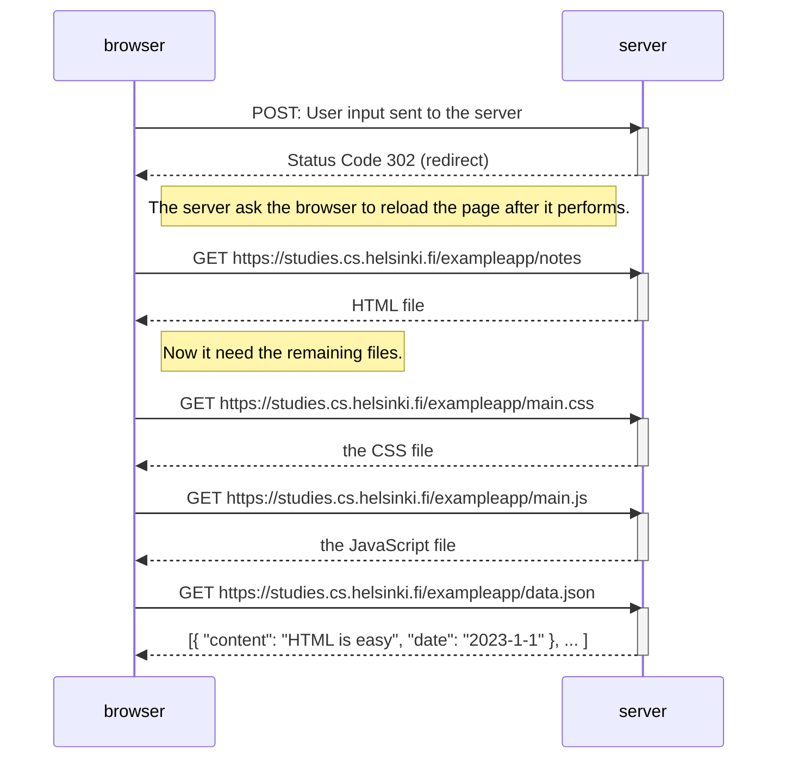

```mermaid
sequenceDiagram
participant browser
participant server

    browser->>server: POST: User input sent to the server
    activate server
    server-->>browser: Status Code 302 (redirect)
    deactivate server
    Note right of browser: The server ask the browser to reload the page after it performs.

    browser->>server: GET https://studies.cs.helsinki.fi/exampleapp/notes
    activate server
    server-->>browser: HTML file
    deactivate server

    Note right of browser: Now it need the remaining files.

    browser->>server: GET https://studies.cs.helsinki.fi/exampleapp/main.css
    activate server
    server-->>browser: the CSS file
    deactivate server

    browser->>server: GET https://studies.cs.helsinki.fi/exampleapp/main.js
    activate server
    server-->>browser: the JavaScript file
    deactivate server


    browser->>server: GET https://studies.cs.helsinki.fi/exampleapp/data.json
    activate server
    server-->>browser: [{ "content": "HTML is easy", "date": "2023-1-1" }, ... ]
    deactivate server
```
