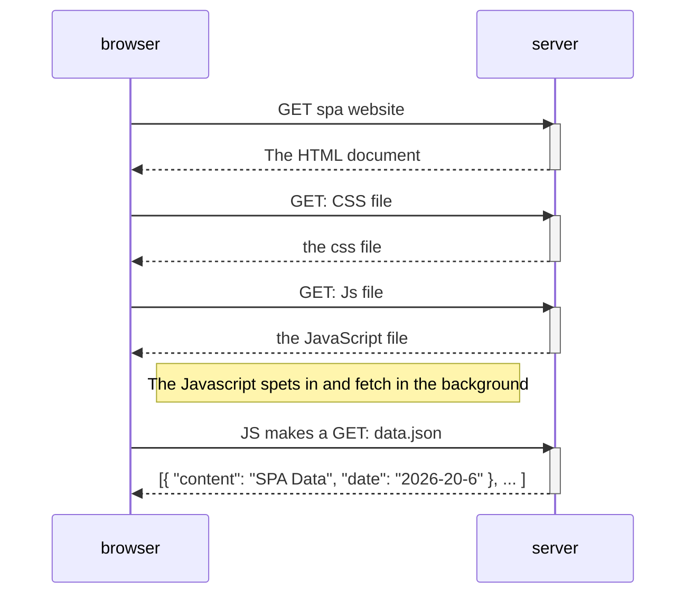

```mermaid
sequenceDiagram
participant browser
participant server

    browser->>server: GET spa website
    activate server
    server-->>browser: The HTML document
    deactivate server

    browser->>server: GET: CSS file
    activate server
    server-->>browser: the css file
    deactivate server

    browser->>server: GET: Js file
    activate server
    server-->>browser: the JavaScript file
    deactivate server

    Note right of browser: The Javascript spets in and fetch in the background

    browser->>server: JS makes a GET: data.json
    activate server
    server-->>browser: [{ "content": "SPA Data", "date": "2026-20-6" }, ... ]
    deactivate server

```
