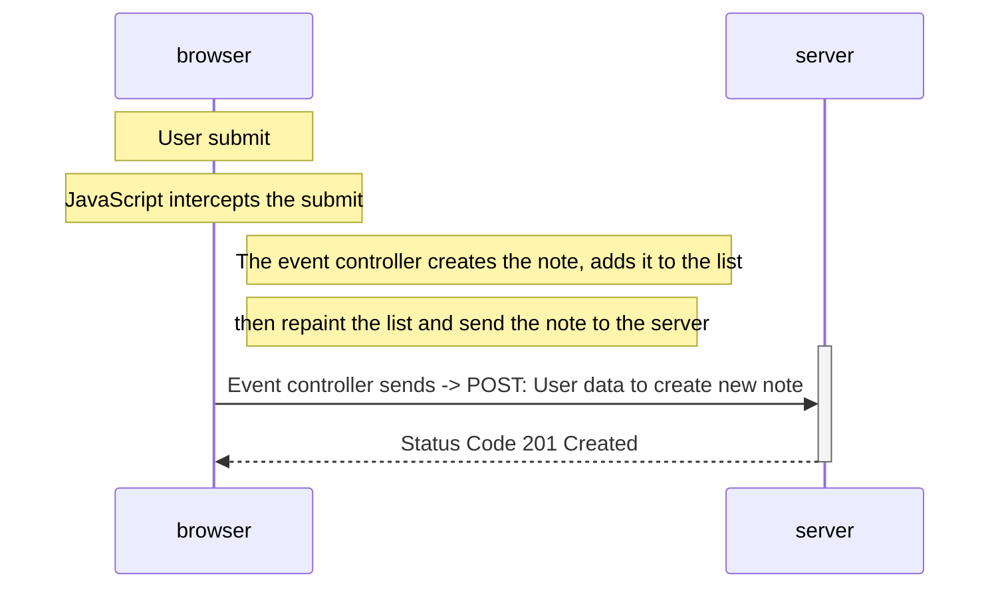

```mermaid
sequenceDiagram
participant browser
participant server

    Note over browser: User submit
    Note over browser: JavaScript intercepts the submit
    Note right of browser: The event controller creates the note, adds it to the list
    Note right of browser: then repaint the list and send the note to the server
    activate server
    browser->>server: Event controller sends -> POST: User data to create new note
    server-->>browser: Status Code 201 Created
    deactivate server
```
